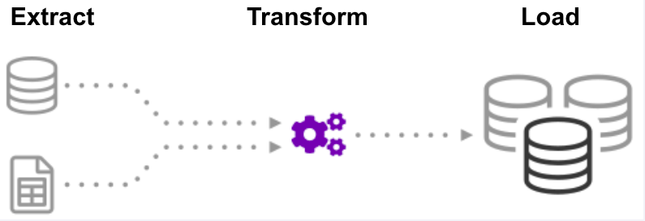

# ETL

## Description
A pipe line to extract, transform and load data from OpenAQ to calculate air quality of cites

## Installation
- python 3.8

## Usage
- Clone the repository name
- Gather the data from OpenAQ
- pip install requirements.txt
- python main.py